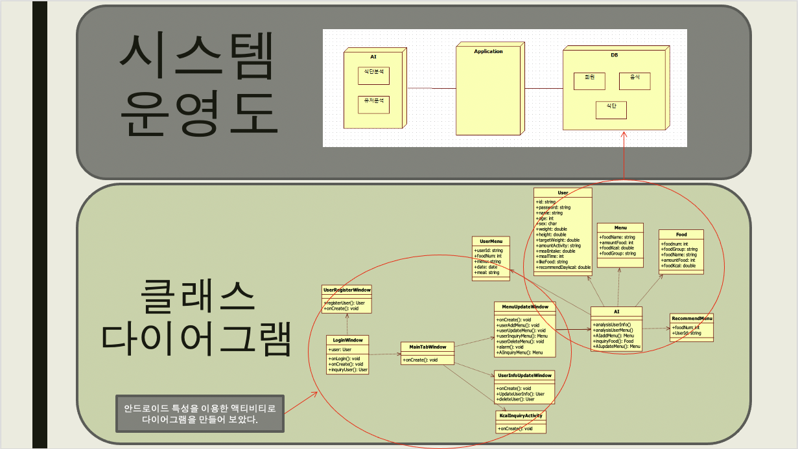

# 식단 추천 애플리케이션

1. 초기 사용자 ( 가입자 )

    간단한 설문 조사를 통하여 사용자의 초기 데이터를 수집하고 초기 데이터는 매뉴얼대로 정해진 식단을 추천받는다.

2. 일반 사용자 ( 사용 일주일 )

    사용자가 식사를하고난뒤 그 데이터를 앱을 통해 데이터를 수집하고 데이터를 분석하여 다음에 섭취 할 해당 칼로리 및 음식 취향을 고려하여 새로운 식단을 추천한다.

## Git Repository Description

`Client` : Android

`Server` : Java

## 기술 스택

-   `MySQL` , `Apache Tomcat` , `JSP` , `Android` , `JAVA` , `MVC pattern` , `Python`, `tensorflow`

## 기능 리스트

-   회원
-   음식 : `AI server`가 DB를 매일 분석하여 다음날 `사용자의 식단`을 짜기위한 데이터
-   식단 : 사용자에게 제공되는 음식들의 정보
-   분석 : python의 Tensorflow Library를 활용

## PPT

